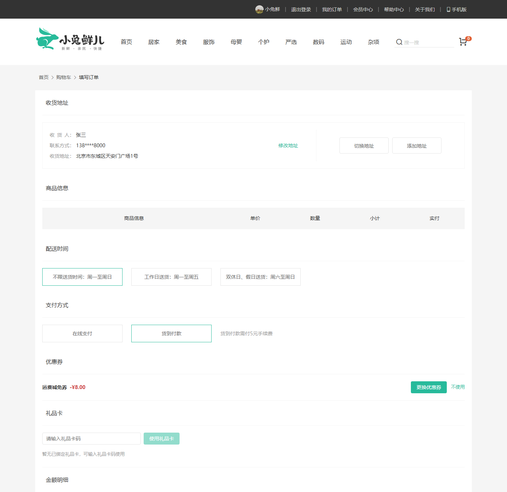
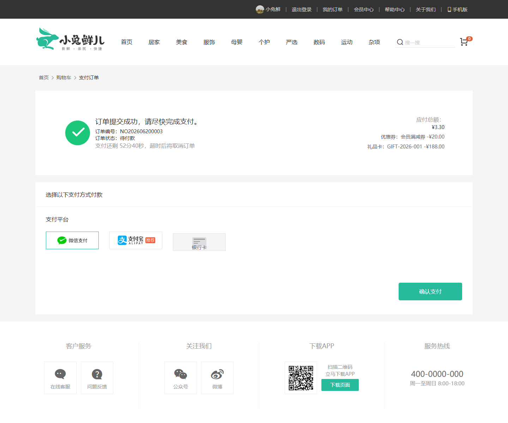

# 小兔鲜儿 PC 商城前端

## 项目简介

小兔鲜儿 PC 商城前端是一个基于 Vue 3 的电商前端项目，覆盖首页、商品分类、商品详情、购物车、结算、订单、支付页、订单详情和会员中心等流程。项目支持对接本地 Mock Service，也可以对接真实微服务后端，已完成库存展示、优惠券与礼品卡结算、货到付款手续费计算、异步下单轮询等页面能力。

## 技术栈

- Vue 3
- Vue Router
- Vuex
- Axios
- Vue CLI
- Less
- VeeValidate
- dayjs
- @vueuse/core
- Mockjs

## 核心功能

- 首页商品展示与分类导航
- 商品列表、库存排序与仅看有货
- 商品详情 SKU 选择、库存展示和低库存提示
- 购物车数量校验和库存校验
- 结算页地址、配送时间、支付方式选择
- 结算页优惠券选择、礼品卡使用和货到付款手续费计算
- 同步/异步下单请求封装
- 异步下单 PROCESSING 状态轮询
- 支付页优惠券和礼品卡抵扣展示
- 订单详情页权益、支付方式和配送信息展示
- 会员中心、收藏和浏览历史

## 页面模块

- `src/views/Layout`：站点布局、导航与公共壳层
- `src/views/home`：首页、品牌与专题展示
- `src/views/category`：分类列表、库存排序与筛选
- `src/views/goods`：商品详情、SKU 选择与库存提示
- `src/views/cart`：购物车数量修改、批量勾选与库存校验
- `src/views/member/pay`：结算页、支付页与异步下单结果反馈
- `src/views/member/order`：订单列表、订单详情与复购
- `src/api`：商品、购物车、会员、订单、支付等接口封装

## 接口模式

项目支持两种接口模式：

1. Mock 模式：对接 `xiaotuxian-mall-mock-service`，适合前端页面演示和本地联调。
2. 真实服务模式：对接主仓库中的 Spring Boot 微服务，支持 Redis Lua 库存预扣、RabbitMQ 异步下单、订单状态轮询等链路。

## 项目截图

首页：


分类页与库存排序：


购物车：


结算页权益抵扣：



支付页权益摘要：



## 本地启动

### 环境要求

- Node.js 16+
- npm 8+

### 安装依赖

```bash
npm install
```

### 启动开发服务器

```bash
npm run serve
```

默认访问地址：

- `http://localhost:8086`

## 构建

```bash
npm run build
```

## 相关仓库

- [xiaotuxian-mall](https://github.com/18307519324az/xiaotuxian-mall)
- [xiaotuxian-mall-mock-service](https://github.com/18307519324az/xiaotuxian-mall-mock-service)
