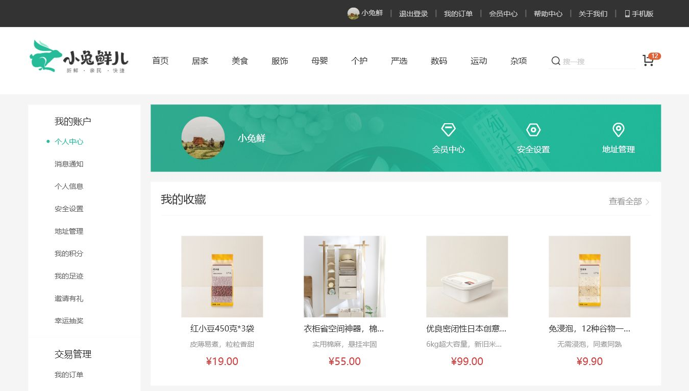

# 小兔鲜儿 PC 商城前端

小兔鲜儿 PC 商城前端是一个基于 Vue 3 的电商前端项目，配合本地 Mock Service 可完成首页、商品、购物车、结算和订单等核心流程演示。

## 技术栈

- Vue 3
- Vue Router
- Axios
- Vuex 4
- Vue CLI 4
- Less
- VeeValidate 4
- dayjs
- @vueuse/core
- Mockjs

## 功能模块

- 首页
- 商品分类
- 商品搜索
- 商品详情
- 购物车
- 结算页
- 订单列表
- 订单详情
- 地址管理
- 会员中心
- 收藏与浏览历史

## 项目预览

| 首页 | 分类页 |
|---|---|
|  |  |

| 购物车 | 会员中心 |
|---|---|
|  |  |

## 安装依赖

```bash
npm install
```

## 启动开发环境

```bash
npm run serve
```

默认访问地址：

```
http://localhost:8080
```

## 接口地址

默认接口地址：

```
http://localhost:8099/
```

可通过环境变量配置：

```
VUE_APP_API_BASE_URL=http://localhost:8099/
```

## 构建

```bash
npm run build
```

## 关联项目

- Mock Service：`https://github.com/18307519324az/xiaotuxian-mall-mock-service`
- 总项目：`https://github.com/18307519324az/xiaotuxian-mall`

## 说明

本项目定位为 PC 端商城演示项目，建议浏览器宽度不低于 1240px。
